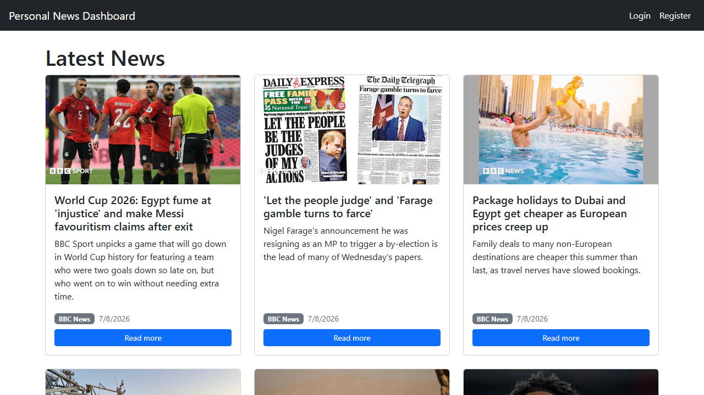
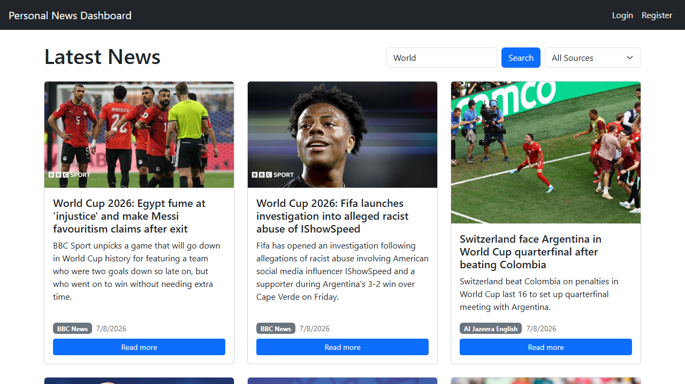
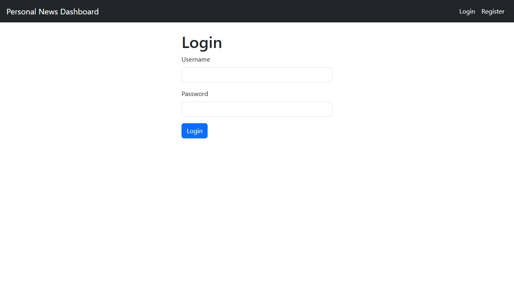
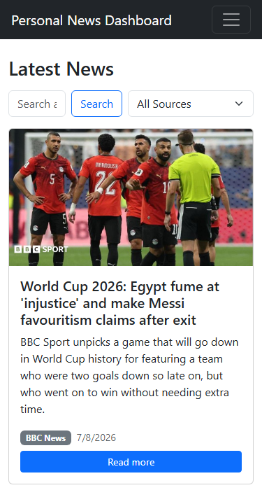

# Personal News Dashboard

A full-stack news aggregator where users can browse headlines from multiple
sources, filter and search them, and save articles to read later. Built as a
portfolio project to practice a complete React + Node/Express + MySQL stack
end to end.

## Screenshots

| Feed | Search & Filter |
|---|---|
|  |  |

| Login | Mobile view |
|---|---|
|  |  |

## Features

- Aggregated news feed from BBC, Al Jazeera, Associated Press, Independent,
  and The Times of India, fetched via [NewsAPI](https://newsapi.org) and
  cached in MySQL (refreshed automatically every 30 minutes)
- Filter articles by source and search by keyword
- User registration and login with session-based authentication
- Logged-in users can save/unsave articles and view them on a dedicated
  Saved Articles page
- Responsive layout, including a collapsible mobile navbar

## Tech Stack

**Frontend:** React, React Router, Bootstrap
**Backend:** Node.js, Express.js
**Database:** MySQL (raw SQL via `mysql2`, no ORM)
**Auth:** `express-session` with a MySQL-backed session store, passwords
hashed with `bcryptjs`

## Architecture

A standard three-tier setup:

- **Client** (`/client`) — a React SPA that calls the API with `fetch`,
  sending the session cookie on every request.
- **Server** (`/server`) — an Express REST API. It also runs a scheduled job
  (`node-cron`) that fetches headlines from NewsAPI and caches them in
  MySQL, so the frontend never waits on a third-party API and NewsAPI's
  free-tier rate limit is never at risk.
- **Database** — MySQL, with four tables: `users`, `articles` (the news
  cache), `saved_articles` (a join table for the save feature), and
  `sessions` (managed automatically by the session store).

Raw SQL was used instead of an ORM deliberately — it keeps every query
explicit and avoids adding an abstraction layer on top of a database you
already know how to query directly.

## Project Structure

```
client/               React app (Vite)
  src/
    components/        Navbar
    pages/              Home, Login, Register, Saved, NotFound
    config.js          API base URL

server/                Express API
  config/               DB connection, session config, schema.sql
  controllers/          Request handlers
  models/               Raw SQL queries
  routes/                Route definitions
  middleware/            requireAuth (protects login-only routes)
  jobs/                  Scheduled NewsAPI fetch job
```

## Getting Started

### Prerequisites

- Node.js 18+ (uses the built-in `fetch` API)
- A running MySQL server
- A free API key from [newsapi.org](https://newsapi.org)

### 1. Set up the database

```bash
mysql -u root -p < server/config/schema.sql
```

This creates a `news_dashboard` database with the required tables.

### 2. Configure environment variables

```bash
cd server
cp .env.example .env
```

Edit `.env` with your MySQL credentials and NewsAPI key.

### 3. Install and run the backend

```bash
cd server
npm install
npm start
```

The API runs on `http://localhost:5000` and immediately fetches and caches
news on startup.

### 4. Install and run the frontend

```bash
cd client
npm install
npm run dev
```

The app runs on `http://localhost:5173`.

## What This Project Demonstrates

- Session-based authentication (registration, hashed passwords, protected
  routes) as an alternative to token-based auth
- Designing a relational schema with a many-to-many relationship
  (`saved_articles` joining `users` and `articles`)
- Integrating a third-party API with real-world constraints: rate limits,
  discontinued/unsupported sources, and caching to avoid hitting either
- React data fetching with `useEffect`/`useState`, including re-fetching
  when a filter or search term changes
- Building a REST API with clear separation between routes, controllers,
  and models

## Notes

The original source list (BBC, CNN, Reuters, Al Jazeera, Firstpost) changed
during development: CNN and Reuters no longer offer public RSS feeds, and
Firstpost and The Guardian aren't available through NewsAPI. They were
replaced with Associated Press, Independent, and The Times of India after
verifying what NewsAPI actually supports.
